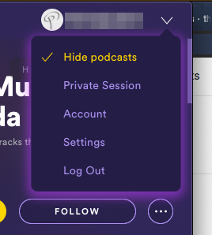

# spicetify-hide-podcasts
[Spicetify](https://github.com/khanhas/spicetify-cli) extension to hide podcasts. Hides the podcasts link in the sidebar and podcast carousel items (e.g. in 'Home' and 'Made For You'). Based on the [ChristianSpotify](https://github.com/khanhas/spicetify-cli/wiki/Extensions#christian-spotify) extension.
## Install
Copy `hidePodcasts.js` into your [Spicetify](https://github.com/khanhas/spicetify-cli) extensions directory:
| **Platform** | **Path**                                                                            |
|------------|-----------------------------------------------------------------------------------|
| **Linux**      | `~/.config/spicetify/Extensions` or `$XDG_CONFIG_HOME/.config/spicetify/Extensions/` |
| **MacOS**      | `~/spicetify_data/Extensions` or `$SPICETIFY_CONFIG/Extensions`                      |
| **Windows**    | `%userprofile%\.spicetify\Extensions\`                                              |

After putting the extension file into the correct folder, run the following command to install the extension:
```
spicetify config extensions hidePodcasts.js
spicetify apply
```
Note: Using the `config` command to add the extension will always append the file name to the existing extensions list. It does not replace the whole key's value.

Or you can manually edit your `config.ini` file. Add your desired extension filenames in the extensions key, separated them by the | character.
Example:

```ini
[AdditionalOptions]
...
extensions = autoSkipExplicit.js|shuffle+.js|trashbin.js|hidePodcasts.js
```

Then run:

```
spicetify apply
```

## Usage
Toggle in the Profile menu.




## More
🌟 Like it? Gimme some love!    


If you find any bugs or places where podcasts are still showing up, please [create a new issue](https://github.com/theRealPadster/spicetify-hide-podcasts/issues/new/choose) on the GitHub repo.    

